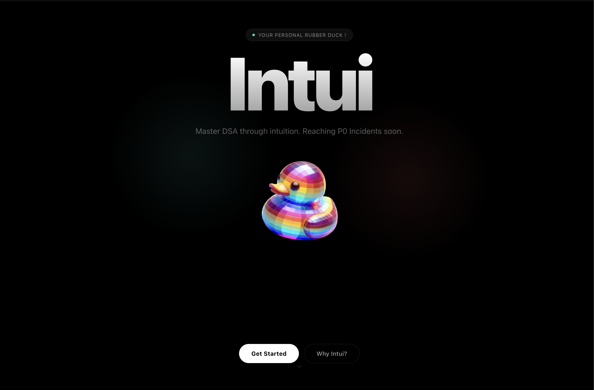
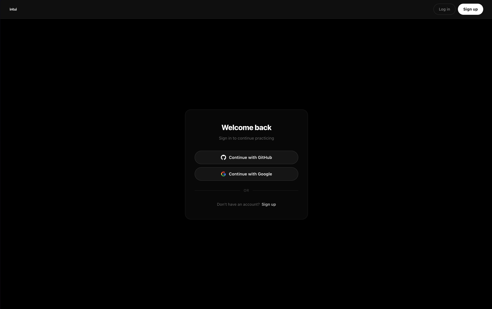
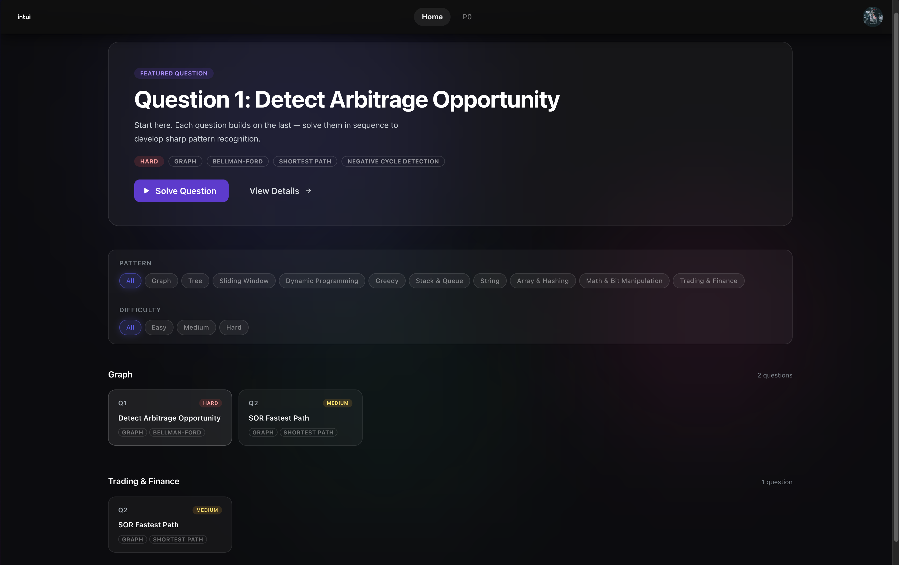
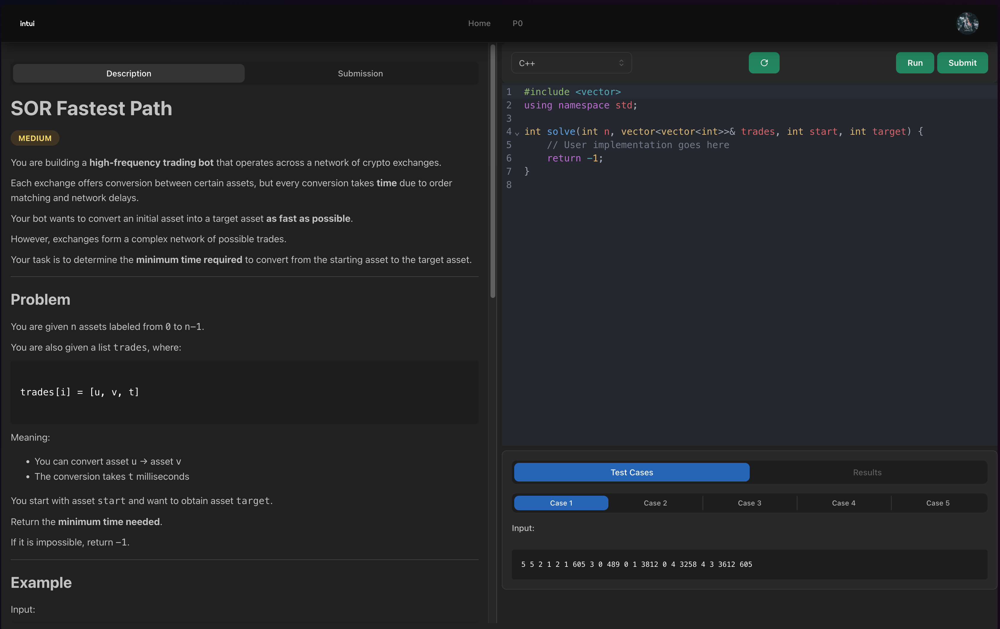
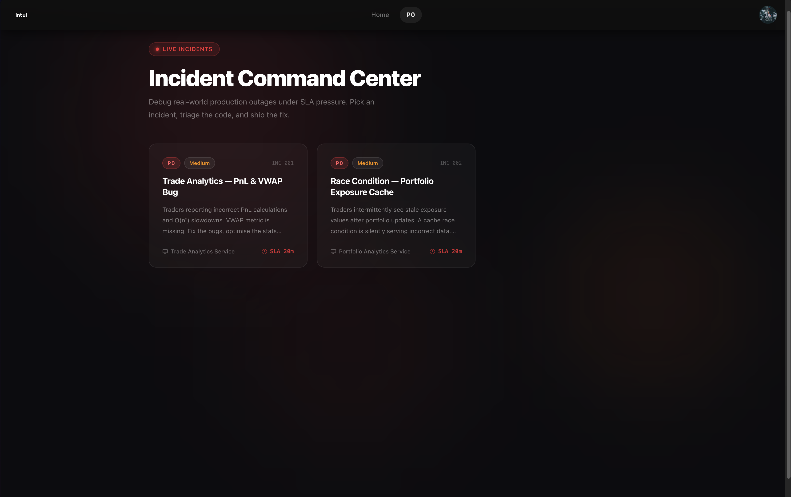
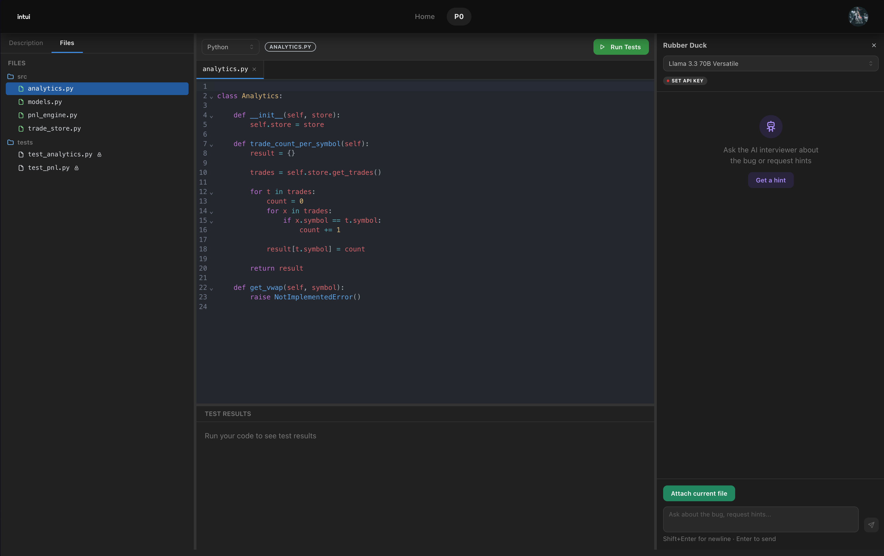
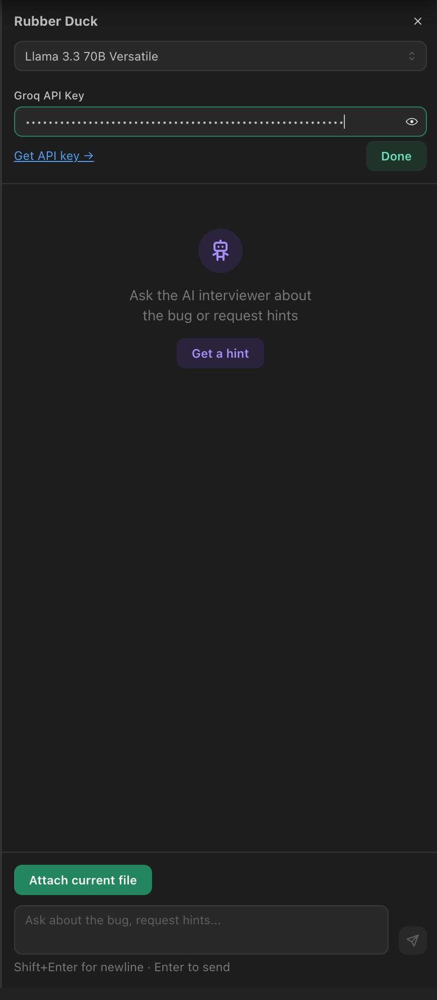
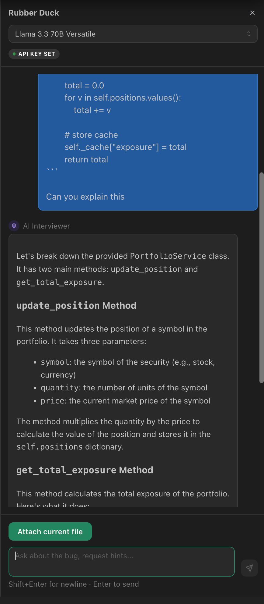

<p align="center">
  
</p>

<p align="center">
  
</p>

> **Interactive coding playground and learning platform**

Intui is a modern web application built with Next.js (app router) and Mantine UI, designed to provide users with an embedded code editor, question bank, and execution backend. It includes authentication, real‑time execution, and a modular component library for rapid feature development.

## 📸 Screenshots

### Landing Page


### Login


### DSA Playground



### P0 Simulation



### AI BYOK Feature



## 🚀 Features

- **Next.js app router** with optimized server‑side rendering and API routes
- **Mantine UI** for consistent, themeable components
- Rich **code editor** with syntax highlighting and execution
- **Authentication** via GitHub and Google
- Support for **submissions**, **questions**, and **playground** interactions
- Google Cloud storage integration for assets and execution data
- Built‑in **Storybook** and **Jest** testing setup
- Environment configuration through `.env` with clear example

## 🛠️ Getting Started

### Prerequisites

- Node.js 18+ (or LTS)
- [pnpm](https://pnpm.io/) (preferred package manager)
- A PostgreSQL database (see `DATABASE_URL`)

### Installation

```bash
git clone https://github.com/your-org/intui.git
cd intui
pnpm install
```

Copy environment variables from the example:

```bash
cp .env.example .env
# then edit `.env` with your values
```

### Running Locally

Development server:

```bash
pnpm dev
```

Build for production:

```bash
pnpm build
pnpm start
```

### Database Seeding

Seed the local database with questions and incidents:

```bash
pnpm run db:seed
```

If you want to export the current question bank to JSON:

```bash
pnpm run db:seed:export
```

Seeding works in both places:

- Locally, it reads from `data/questions` and `data/incidents` if they exist.
- In Vercel CI, if `data/` is missing, it pulls `questions/` and `incidents/` from the GCS bucket configured by `GCP_BUCKET_NAME` and the other `GCP_*` env vars.

### Vercel CI (Auto Migrate + Auto Seed)

Set the Vercel Build Command to this so each push runs migrations, seeds, and then builds:

```bash
pnpm run vercel:build
```

`vercel:build` runs `scripts/ci-build.cjs`, which does:

1. `prisma generate`
2. `prisma migrate deploy`
3. if migration fails with `P3005` (non-empty DB baseline case), it falls back to `prisma db push --accept-data-loss`
4. `prisma db seed` and therefore `prisma/seed.cjs`
5. `next build`

Note: the `P3005` fallback is for first-time baseline/drifted databases in CI. It may alter schema destructively to match `schema.prisma`.

Required Vercel environment variables:

- `DATABASE_URL` (production DB connection string)
- OAuth and any other runtime vars from `.env.example`
- GCP storage credentials plus `GCP_BUCKET_NAME` so seed can download `questions/` and `incidents/` from the bucket

How to update prod question data:

1. Update the source data in `data/questions` and `data/incidents`, or update the GCS bucket contents if that is your canonical source.
2. Push to main.
3. Vercel CI will run `pnpm run vercel:build`, which seeds from `prisma/seed.cjs` before building.

Analyze bundle size:

```bash
pnpm analyze
```

### Storybook

```bash
pnpm storybook
```

### Testing

```bash
pnpm test
```

### Docker (optional)

For a containerized setup using `docker-compose`:

```bash
docker-compose up --build
```

## 📁 Project Structure

```
/ app/                # Next.js pages and components
/ components/         # Reusable React components
/ lib/                # Shared utilities and API clients
/ contexts/           # React context providers
/ prisma/             # Database schema and migrations
/ public/             # Static assets
/ test-utils/         # Utilities for tests
```

## 🔧 Environment Variables

See `.env.example` for a full list. Key variables include:

- `DATABASE_URL` – PostgreSQL connection string
- `GITHUB_CLIENT_ID`, `GITHUB_CLIENT_SECRET` – GitHub OAuth
- `GOOGLE_CLIENT_ID`, `GOOGLE_CLIENT_SECRET` – Google OAuth
- `GCP_*` – Google Cloud service account details

## 🤝 Contributing

No contributons are allowed sorry ://

## 📄 License

All Rights Reserved @ Shivam Jain


---
